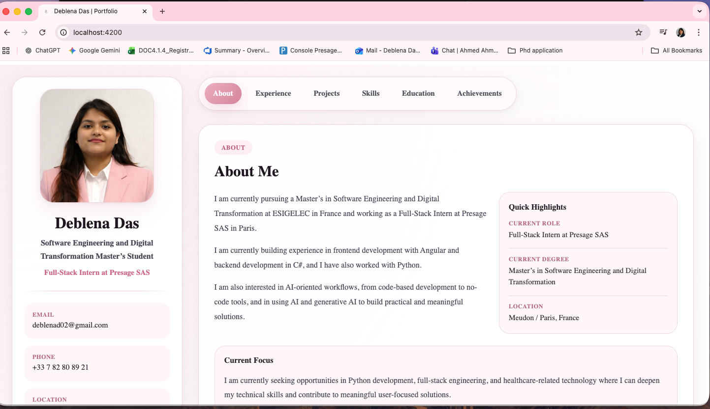

# Deblena Das Portfolio

A personal portfolio website built with Angular to present my background, experience, projects, skills, and career focus in a clean and minimal layout.

## Live Demo

[View Portfolio](https://deblena-portfolio.netlify.app/)

## Preview



## About the Project

This portfolio presents:

- A personal introduction and current focus
- Professional experience
- Highlighted projects
- Skills and education
- Achievements and contact links

The design follows a soft pink and clean minimal theme, with a structured layout for both desktop and responsive viewing.

## Tech Stack

- Angular
- TypeScript
- HTML
- CSS

## Features

- Responsive portfolio layout
- About Me section
- Experience section with highlighted internship work
- Project showcase
- Skills and education sections
- Achievement section
- Contact and profile links
- Custom visuals and themed styling

## Development

To start the local development server:

```bash
ng serve
```
Then open http://localhost:4200/ in your browser.

## Build
To create a production build:
```bash
ng build
```
The build output will be generated in the dist/ directory.
## Author
# Deblena Das

Master’s student in Software Engineering and Digital Transformation at ESIGELEC, currently working as a Full-Stack Intern at Presage SAS in Paris.

## Contact

Email: deblenad02@gmail.com
GitHub: deblenad02